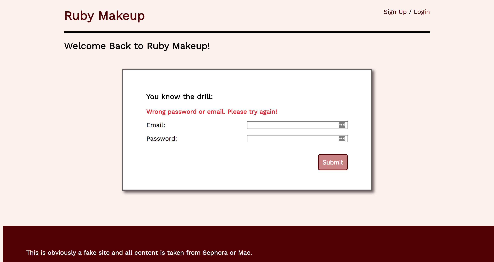
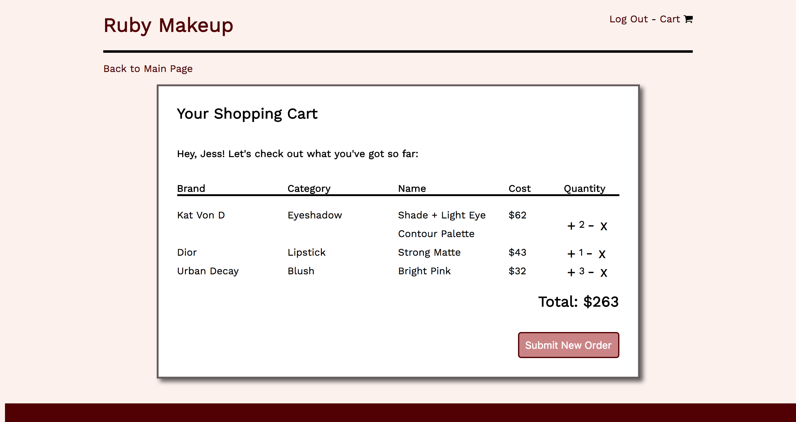

# Ruby Makeup: Your One Stop Shop for Real Makeup from a Not-Real Store

## Usage
To use this app, just clone, run `rake db:migrate`, `rake db:seed` for some products and then `shotgun` to get her running.

## Description
The requirements of this app were to:
- make a Sinatra app using ActiveRecord (check)
- have multiple models (check)
- have at least one has_many relationship (the cart has many products)
- have users (sure do!)
- ensure that the belongs_to resource has routes for Creating, Reading, Updating and Destroying (read, update, delete in the Cart and create Orders)

# Extra info you might be interested in

## Landing Page
The landing page is viewable logged in or out. If a user is not logged in, the "Add to Cart" buttons don't render and the header says "Sign In / Login". If the user is logged in, the header will have a log out option and a link to their cart. The header behaves this way on every page to avoid users accessing the cart before signing in. If the user tries to access routes that are not directly accessible through the page and for which they don't have access rights, they will be redirected to the main page again. The main product page can also be sorted by product category. This is to make browsing more enjoyable and faster, of course!

## Authentication
User's must provide a first name, email, and password to sign up. The password is stored encrypted. All fields on the sign up and log in page are required and the page will display an error if they are submitted empty. If the password is incorrect while loggin in, an error message will display on the login page. The page will redirect to the main products page after logging in and logging it. If you try to logout while not logged it, you'll be redirected to the login page (and stop trying to break my app because there's no logout button if you're not logged in.)

## Individual Products
Products can only be viewed individually when the user has logged in. The product description is included in this view. Products can be added to the user's cart from this view or the main product page view.

## Cart
A user only ever has one cart. Either it's the one they're currently shopping with or it's deleted when the order is submitted. The thinking here was that if this were a real site I would want to cart to persist until the user made an order, and once the order is created the order will track all the cart info. Deleting a product from the cart deletes the associated row from the "cart" table. Updating the product quantity will edit the quantity value in the associated cart row. In terms of security, the users can only access their own cart, of which there is only ever one.

# Orders
Currently the cart goes directly to the order page and just let's the user know the order was received. There's room to expand this to show an order history and to maintain order details that were available in the cart (a line item view of the order) but let's save that for another day.

# Styling
I could spend a LOT of time on this but I decided to keep it simple and not get too distracted by buttons and alignments. Most of the alignment is done with CSS Grid. It still needs a little responsiveness love. <3

# Check It Out
Ruby Makeup is currently deployed at https://ruby-makeup-85046.herokuapp.com/products
